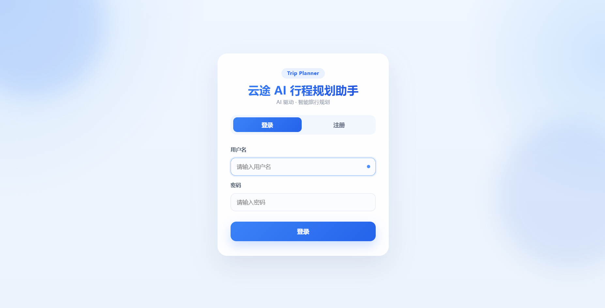
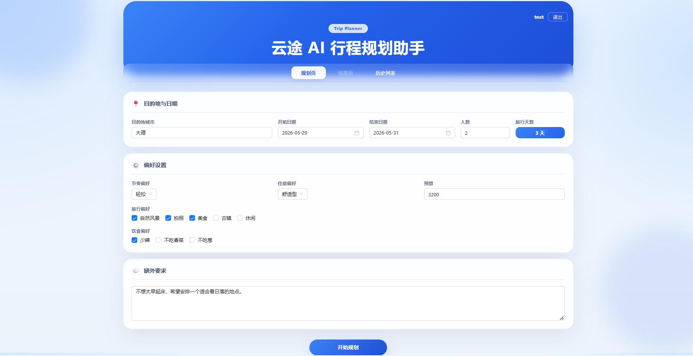
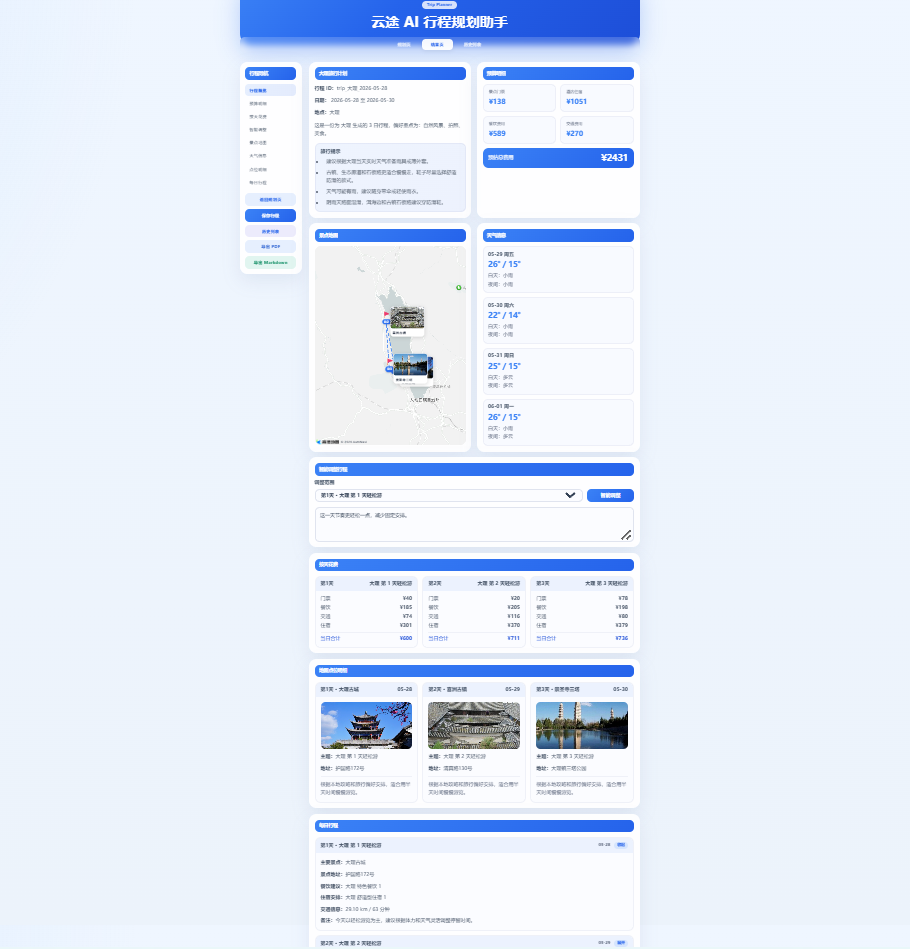
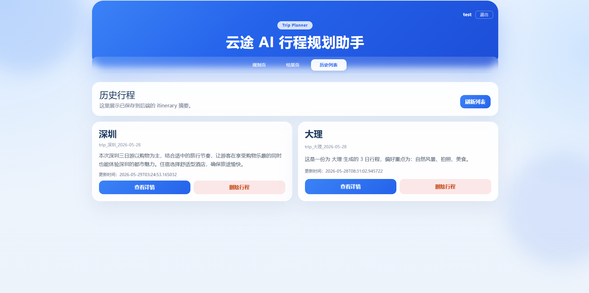
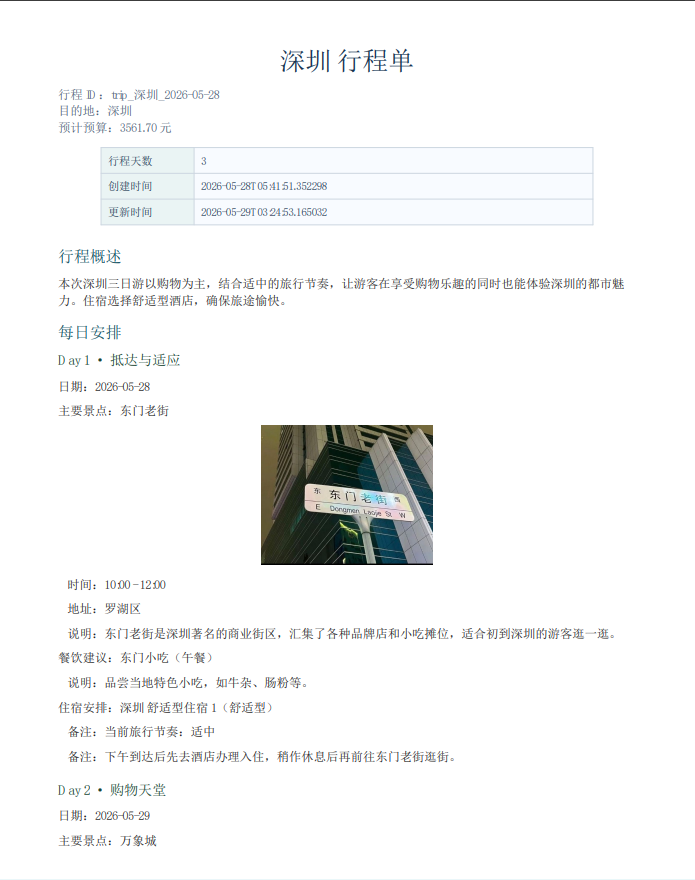
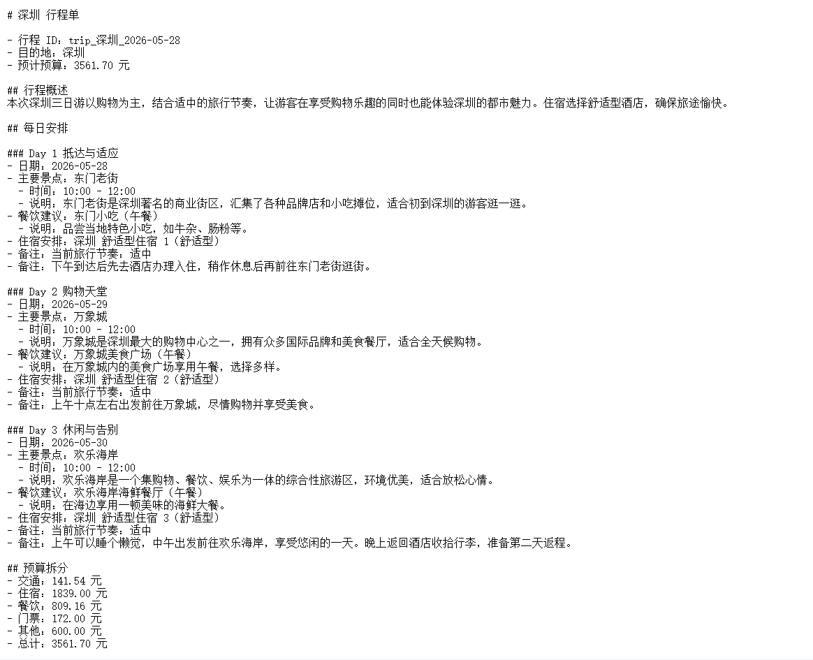

# 🗺️ 云途 AI 行程规划

> 融合大模型、RAG、本地攻略与高德地图能力的智能旅行规划系统

云途 AI 行程规划是一个面向中文旅行场景的 AI 旅行规划项目。用户输入目的地、日期、预算、人数和偏好后，系统会自动生成结构化旅行方案，并进一步补充地图点位、天气信息、预算拆分、景点图片与可导出的旅行文档。

相比只输出一段文本的 LLM Demo，这个项目更强调完整链路落地：从 **行程生成、攻略检索、地图信息补全、天气补充，到历史管理与文档导出**，尽量把 AI 能力组织成一个可交互、可保存、可展示的产品原型。

## 📝 最近更新

- `2026-06-05`
  - 🐳 **Docker 全栈部署**：Docker Compose 一键编排 Redis + FastAPI + Nginx，支持健康检查、日志轮转、资源限制、Redis 密码认证
- `2026-05-28`
  - 🎯 **RAG 架构升级**：新增 Milvus Lite 向量库支持，通过 `VECTOR_STORE` 切换 Chroma/Milvus；实现稠密+稀疏混合检索，融合向量相似度与关键词打分。
  - 🛡️ **LLM 稳定性增强**：新增 `JsonOutputParser` 结构化输出约束；指数退避重试（含 jitter）；LLM/Redis/Amap 熔断器保护。
  - ⚡ **缓存优化**：按业务类型分级 TTL（天气 30min / 地图 24h / RAG 6h / Rerank 6h）；Null 值缓存防穿透。
  - 🔐 **用户系统**：JWT 鉴权（注册/登录）、API 限流、行程归属隔离。
  - 🎨 **前端重构**：Ant Design Vue 登录/注册页、鉴权守卫、高德地图可视化恢复。
- `2026-05-19`
  - token 消耗统计、接口观测
- `2026-05-07`
  - Cross-encoder Rerank、Rerank 缓存、Top1 命中率 93.3%

---

## ✨ 项目亮点

- 🧠 **LLM 行程生成**：LangChain + DashScope `qwen-max`，支持 JsonOutputParser 约束 + 指数退避重试 + 熔断保护
- 📚 **RAG 攻略增强**：Chroma / Milvus Lite 双后端 + 稠密稀疏混合检索 + LLM Query Rewrite + Cross-encoder Rerank（qwen3-rerank）
- 🗺️ **高德地图接入**：POI 坐标、路线估算、景点图片、虚线箭头路线可视化
- 🌦️ **天气感知提示**：前端天气预报展示，雨天自动修正旅行建议
- ⚡ **Redis 缓存层**：按业务分级 TTL + Null 值缓存穿透防护
- 🔐 **用户鉴权**：JWT 注册/登录 + bcrypt 密码加密 + 接口限流
- 🪄 **智能编辑**：自然语言调整行程，LLM 单日编辑
- 📄 **文档导出**：Markdown + 中文 PDF 导出

---

## 📸 项目展示

| 登录 | 规划 | 行程生成 |
| :---: | :---: | :---: |
|  |  |  |

| 保存 | PDF 导出 | Markdown 导出 |
| :---: | :---: | :---: |
|  |  |  |

---

## 🏗️ 技术架构

### 技术栈

- **后端**：FastAPI + Pydantic + SQLAlchemy
- **LLM**：LangChain + DashScope (`qwen-max`)
- **向量库**：ChromaDB / Milvus Lite（可切换）
- **缓存**：Redis（分级 TTL + 熔断保护）
- **鉴权**：JWT (python-jose) + bcrypt
- **前端**：Vue 3 + Vite + Ant Design Vue 4
- **数据库**：SQLite
- **容器化**：Docker Compose 全栈编排（Redis + FastAPI + Nginx）

### 核心架构分层

| 层级 | 关键文件 | 职责 |
| :--- | :--- | :--- |
| 前端 | `frontend/src/views/*.vue` | 登录页、规划页、结果页（地图/天气/预算）、历史页 |
| 接口层 | `backend/app/api/routes/` | user、trip、export、weather 路由 |
| 服务层 | `backend/app/services/` | 行程编排、地图 enrich、天气、缓存、导出、存储 |
| Agent 层 | `backend/app/agents/` | LLM 行程生成 + Query Rewrite |
| RAG 层 | `backend/app/rag/` | 向量入库/检索（Chroma/Milvus）、Cross-encoder Rerank |
| 工具层 | `backend/app/utils/` | 日志、限流、鉴权、JsonOutputParser、重试、熔断 |
| 数据层 | `backend/data/` | 本地 Markdown 攻略文档（5个城市） |

---

## 🚀 快速启动

### Docker Compose（推荐，一键部署）

```bash
cd yun-trip-ai

# 1. 配置环境变量
cp backend/.env.example backend/.env      # 编辑填写 LLM_API_KEY、AMAP_API_KEY 等
cp frontend/.env.example frontend/.env    # 编辑填写 VITE_AMAP_JS_KEY

# 2. 初始化 RAG 数据
cd backend
pip install -r requirements.txt
python scripts/ingest_data.py
cd ..

# 3. 启动全部服务
docker compose up -d --build
```

启动后访问 `http://localhost`，Nginx 会自动代理后端 API 和前端页面。

| 服务 | 端口 | 说明 |
| :--- | :--- | :--- |
| 前端 (Nginx) | 80 | Vue SPA + API 反向代理 |
| 后端 (FastAPI) | 8000 | AI 行程规划接口 |
| Redis | 6379 | 缓存服务（密码认证） |

常用命令：

```bash
docker compose down          # 停止
docker compose logs -f       # 查看日志
docker compose up -d --build # 重新构建
```

### 手动启动（开发调试）

### 1. 启动 Redis（可选）

```bash
docker run -d --name tripplanner-redis -p 6379:6379 redis:7
```

### 2. 启动后端

```bash
cd backend
pip install -r requirements.txt
cp .env.example .env   # 编辑 .env 填写 API Key
python -m uvicorn app.api.main:app --host 0.0.0.0 --port 8000
```

### 3. 初始化 RAG 数据

```bash
cd backend
python scripts/ingest_data.py
```

### 4. 启动前端

```bash
cd frontend
npm install
cp .env.example .env   # 编辑 .env 填写后端地址和高德 JS Key
npm run dev
```

启动后访问：`http://127.0.0.1:5173`

---

## 🔐 环境变量

### 新增配置项（v3 优化版）

```env
# 向量库后端（chroma | milvus）
VECTOR_STORE=chroma
MILVUS_DB_DIR=db/milvus_db

# JWT 鉴权
JWT_SECRET_KEY=your-secret-key-change-me
JWT_ALGORITHM=HS256
JWT_EXPIRE_MINUTES=1440

# 接口限流
RATE_LIMIT_PER_MINUTE=60
RATE_LIMIT_GENERATE_PER_MINUTE=5
```

完整配置见 `backend/.env.example` 和 `frontend/.env.example`。

---

## 📡 核心接口

| 方法 | 路径 | 鉴权 | 说明 |
| :--- | :--- | :--- | :--- |
| `POST` | `/user/register` | - | 注册 |
| `POST` | `/user/login` | - | 登录（返回 JWT） |
| `GET` | `/user/me` | JWT | 当前用户信息 |
| `POST` | `/trip/generate` | JWT+限流 | 生成行程 |
| `GET` | `/trip` | JWT | 历史列表 |
| `GET` | `/trip/{trip_id}` | JWT | 行程详情 |
| `DELETE` | `/trip/{trip_id}` | JWT | 删除行程 |
| `POST` | `/trip/edit` | JWT | 智能编辑 |
| `GET` | `/export/{trip_id}/markdown` | JWT | 导出 Markdown |
| `GET` | `/export/{trip_id}/pdf` | JWT | 导出 PDF |
| `GET` | `/weather/forecast` | JWT | 天气查询 |

---

## 🧪 全流程测试步骤

### 1. 后端启动验证
```bash
cd backend
curl http://127.0.0.1:8000/          # → {"message":"云途 AI 行程规划后端服务运行中。"}
curl http://127.0.0.1:8000/health     # → {"status":"ok"}
```

### 2. 用户注册/登录
```bash
# 注册
curl -X POST http://127.0.0.1:8000/user/register \
  -H "Content-Type: application/json" \
  -d '{"username":"test","email":"test@test.com","password":"test123"}'

# 登录（保存返回的 access_token）
TOKEN=$(curl -s -X POST http://127.0.0.1:8000/user/login \
  -H "Content-Type: application/json" \
  -d '{"username":"test","password":"test123"}' \
  | python -c "import sys,json; print(json.load(sys.stdin)['access_token'])")
```

### 3. 行程生成
```bash
curl -X POST http://127.0.0.1:8000/trip/generate \
  -H "Authorization: Bearer $TOKEN" \
  -H "Content-Type: application/json" \
  -d '{
    "destination":"大理",
    "start_date":"2026-06-01",
    "end_date":"2026-06-03",
    "travelers":2,
    "budget":3000,
    "preferences":["自然风景","拍照"],
    "pace":"轻松",
    "dietary_preferences":["少辣"],
    "hotel_level":"舒适型"
  }'
```

### 4. 行程管理
```bash
# 列表
curl http://127.0.0.1:8000/trip -H "Authorization: Bearer $TOKEN"

# 详情
curl http://127.0.0.1:8000/trip/trip_大理_2026-06-01 -H "Authorization: Bearer $TOKEN"

# 删除
curl -X DELETE http://127.0.0.1:8000/trip/trip_大理_2026-06-01 -H "Authorization: Bearer $TOKEN"
```

### 5. 前端验证
1. 浏览器打开 `http://localhost:5173` → 自动跳转登录
2. 注册新用户 → 自动登录
3. 填写目的地/日期/偏好 → 点击"开始规划"
4. 查看结果页：地图、天气、预算、每日行程
5. 保存行程 → 切换到历史列表 → 查看/删除

### 6. 熔断降级验证
```bash
# Redis 不可用时：缓存自动跳过，提示 warning 日志
# LLM 连续失败 5 次后：熔断器打开，拒绝请求 120s
# 熔断恢复：120s 后进入 HALF_OPEN，试探成功自动恢复
```

---

## 🛠️ 常见问题

### Docker 部署

**容器重启/启动失败**
- `docker compose logs backend` 查看后端日志
- 检查 `yun-trip-ai/.env` 中的 `REDIS_PASSWORD` 是否与 `backend/.env` 一致
- `Permission denied` 通常是 volume 权限问题，重建镜像即可：`docker compose up -d --build`

**前端地图不显示**
- `VITE_AMAP_JS_KEY` 是否在 `frontend/.env` 中配置（需 JS API key，非 Web 服务 key）
- Docker 构建时 `.env` 已在构建上下文中，修改后需 `--build` 重建
- 后端 `ENABLE_AMAP_ENRICHMENT` 是否为 `true`

**API 返回 401**
- Nginx 已将 `/api/*` 代理到后端，前端 `.env` 中 `VITE_API_BASE_URL` 应留空
- 首次使用需先注册账号

### 手动启动

### 前端生成失败
- 后端是否启动在正确端口
- `frontend/.env` 的 `VITE_API_BASE_URL` 是否正确
- 修改 `.env` 后是否重启前端

### 地图不显示
- `VITE_AMAP_JS_KEY` 是否配置（需要 JavaScript API key，非 Web 服务 key）
- 后端 `ENABLE_AMAP_ENRICHMENT` 是否为 `true`

### 向量库切换
```env
# .env 中设置
VECTOR_STORE=chroma   # 或 milvus
```
切换后需重新执行 `python scripts/ingest_data.py`

---

## ✅ 当前完成度

- ✅ **后端**：行程 CRUD、JWT 鉴权、限流、天气、导出
- ✅ **AI 能力**：LLM 生成 + JsonOutputParser + 重试 + 熔断
- ✅ **RAG**：Chroma/Milvus 双后端 + 混合检索 + Query Rewrite + Rerank
- ✅ **缓存**：分级 TTL + Null 值防穿透 + 熔断保护
- ✅ **前端**：登录/注册、规划页、结果页（地图/天气/预算）、历史管理
- ✅ **工程化**：Docker Compose 一键部署、日志轮转、健康检查、全链路 token 统计